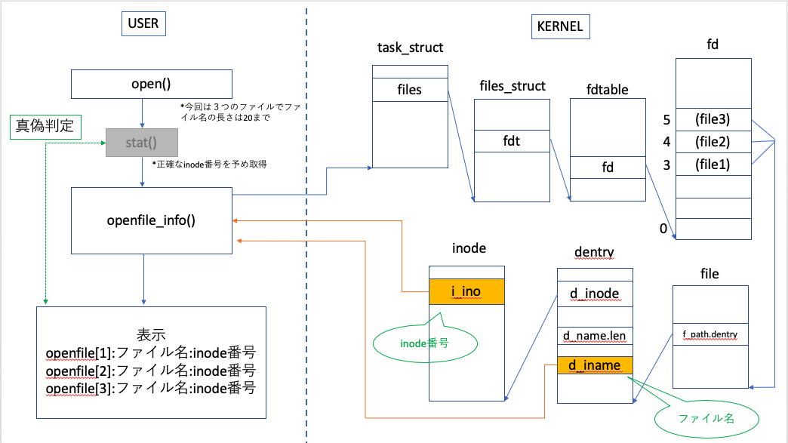

# 自作Linux_SystemCall

## 仕様
- 名称   
　openfile_info 　　 open()で開いたファイルのファイル名とinode番号を取得
- 書式  
　long openfile_info(unsigned long *buff_value, unsigned char *buff_name, unsigned int op_file_num);
- 解説  
　*buff_value : open()したファイルのinode番号の格納先ポインタ  
 　*buff_name : open()したファイルのファイル名と格納先ポインタ  
 　*op_file_num : open()したファイルの数
- 戻り値  
　正常に完了すれば，１を返す  
　正常に完了しない場合はエラーを返す
- エラー  
　ENOENT　　　No such file or directory
 
 
## 構成

